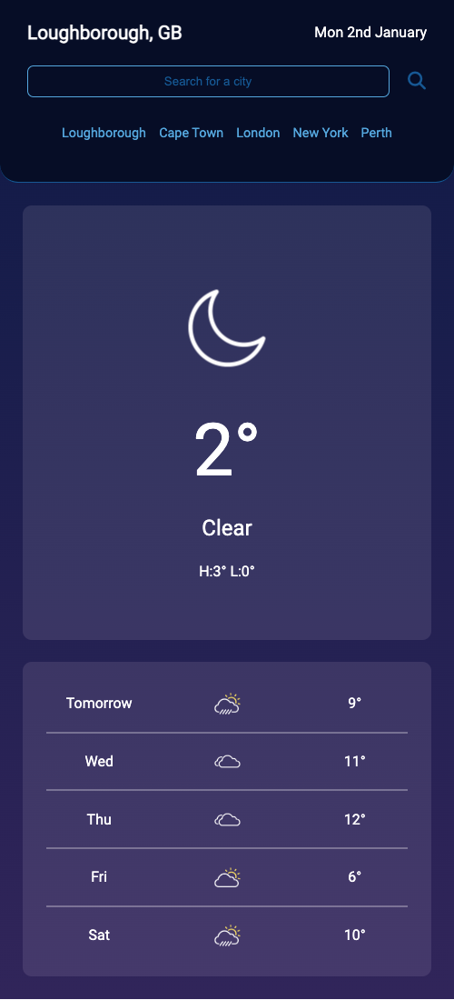

<!-- PROJECT LOGO -->
 

  

<h3 align="center">Weather Dashboard</h3>

  

  Get a jump on the weather with this intuitive and reliable weather app! With just a few taps, you can quickly access detailed forecasts for cities around the globe, empowering you to plan your day with ease and confidence. Utilizing the trusted OpenWeatherMap API, this app provides comprehensive forecasts for the current day and the next five days, including high and low temperatures, humidity levels, and wind speed. Stay one step ahead of Mother Nature with this indispensable app that keeps you informed and prepared for whatever the weather has in store.

 
 
 
<a href="https://abdulwahidhusein.github.io/weather-app-main/">View Live Deployment</a>

  

<!-- TABLE OF CONTENTS -->

  
Table of Contents

  <ol>
    <li>
      <a href="#about-the-project">About The Project</a>
      <ul>
        <li><a href="#built-with">Built With</a></li>
      </ul>
    </li>
        <li><a href="#usage">Usage</a></li>
    <li><a href="#contributing">Contributing</a></li>
    <li><a href="#license">License</a></li>
    <li><a href="#contact">Contact</a></li>
    <li><a href="#acknowledgments">Acknowledgments</a></li>
  </ol>

<!-- ABOUT THE PROJECT -->

## About The Project

User Story:

- AS A traveler
- I WANT to see the weather outlook for multiple cities
- SO THAT I can plan a trip accordingly

Project Summary:

Keep your finger on the pulse of the weather with this dynamic and user-friendly weather dashboard! Using the trusted OpenWeatherMap API, you can easily search for and view detailed weather data for your favorite cities, including the city name, date, weather icon, temperature, humidity, and wind speed. With a 5-day forecast also at your fingertips, you'll have all the information you need to plan your days with confidence.

This dashboard is designed for convenience, with a search history feature that saves your past searches for easy access, and an automatic theme adjuster that changes the look of the page based on whether it's currently day or night in the searched location. Plus, when the page loads, the geolocation API will automatically determine your current location and display the weather for your area.

In addition to providing an enjoyable user experience, working on this project allowed me to gain valuable experience in accessing and retrieving data from RESTful web APIs using AJAX calls, as well as processing returned data and using it with JavaScript logic to generate dynamic page elements. This enables the application to display customized content based on the responses from the API, making it a versatile and effective tool.

(<a href="#readme-top">back to top</a>)

### Built With

[![JQuery][jquery.com]][jquery-url]

(<a href="#readme-top">back to top</a>)

## Usage

The following animation demonstrates the application functionality:

This application is designed to adapt to various screen sizes, including those of mobile devices, and can be easily used on the go, e.g:

(<a href="#readme-top">back to top</a>)

<!-- CONTRIBUTING -->

## Contributing

Contributions are what make the open source community such an amazing place to learn, inspire, and create. Any contributions you make are **greatly appreciated**.

If you have a suggestion that would make this better, please fork the repo and create a pull request. You can also simply open an issue with the tag "enhancement".
Don't forget to give the project a star! Thanks again!

1. Fork the Project
2. Create your Feature Branch (`git checkout -b feature/AmazingFeature`)
3. Commit your Changes (`git commit -m 'Add some AmazingFeature'`)
4. Push to the Branch (`git push origin feature/AmazingFeature`)
5. Open a Pull Request

(<a href="#readme-top">back to top</a>)

<!-- LICENSE -->

(<a href="#readme-top">back to top</a>)

<!-- ACKNOWLEDGMENTS -->

## Acknowledgments

- [Open Weather Map API](https://openweathermap.org/api)
- [Moment.js Docs](https://momentjs.com/)
- [JQuery Docs](https://jquery.com/)
- [JQuery Cheat Sheet](https://htmlcheatsheet.com/jquery/)
- [Introduction to server-side APIs](https://www.codenewbie.org/blogs/an-intro-to-apis)

(<a href="#readme-top">back to top</a>)

<!-- MARKDOWN LINKS & IMAGES -->
[linkedin-shield]: https://img.shields.io/badge/-LinkedIn-black.svg?style=for-the-badge&logo=linkedin&colorB=555
[linkedin-url]: https://linkedin.com/in/mdyeates
[product-screenshot]: assets/images/screenshot.png
[jquery.com]: https://img.shields.io/badge/jQuery-0769AD?style=for-the-badge&logo=jquery&logoColor=white
[jquery-url]: https://jquery.com
